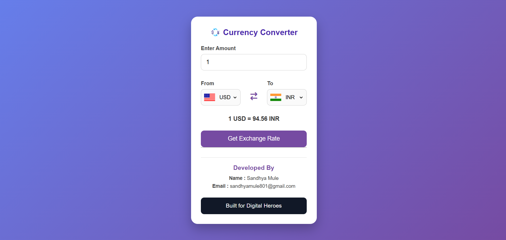

# 💱 Currency Converter

A modern, responsive, and user-friendly **Currency Converter** built using **HTML, CSS, and JavaScript**. This web application allows users to convert one currency into another using real-time exchange rates from a free Currency API. It features automatic country flag updates, an intuitive interface, and a fully responsive design for desktop and mobile devices.

---

## 📸 Project Screenshot




---

## 🚀 Live Demo

**Live Website (Vercel):**

https://currency-converter-one-snowy.vercel.app

---

## 📂 GitHub Repository

https://github.com/sandhya-mule801/Currency-Converter

---

## ✨ Features

- 💱 Real-time currency conversion
- 🌍 Supports multiple international currencies
- 🚩 Automatic country flag updates
- 🔄 Swap currencies with a single click
- ⚡ Fast and accurate conversion
- 📱 Fully responsive design
- 🎨 Clean and modern user interface
- ✅ Input validation
- 🌐 Uses a free Currency Exchange API
- 🆓 Built using only free tools and technologies

---

## 🛠️ Technologies Used

- HTML5
- CSS3
- JavaScript (ES6)
- Fetch API
- Currency Exchange API
- Flags API
- Git & GitHub
- Vercel

---

## 📁 Project Structure

```text
Currency-Converter/
│
├── index.html
├── style.css
├── index.js
├── codes.js
├── README.md
│
└── images/
    └── screenshot.png
```

---

## ⚙️ How to Run This Project

### 1. Clone the Repository

```bash
git clone https://github.com/sandhya-mule801/Currency-Converter.git
```

### 2. Open the Project Folder

```bash
cd Currency-Converter
```

### 3. Run the Project

Open the `index.html` file in your web browser or use the **Live Server** extension in Visual Studio Code.

---

## 📖 How to Use

1. Enter the amount you want to convert.
2. Select the source currency.
3. Select the destination currency.
4. Click the **Get Exchange Rate** button.
5. View the converted amount instantly.
6. Use the **Swap** button to exchange the selected currencies.

---

## 🎯 Project Objectives

- Build a real-world JavaScript project.
- Learn how to use APIs with the Fetch API.
- Practice DOM manipulation and asynchronous programming.
- Create a responsive web interface.
- Deploy the project using GitHub and Vercel.

---

## 👩‍💻 Developer

**Sandhya Ganesh Mule**

📧 Email: sandhyamule801@gmail.com

🐙 GitHub: https://github.com/sandhya-mule801

---

## 📌 About This Project

This project was developed as part of the **Digital Heroes Developer Trial Task**. The objective was to create a useful web application that produces real output while demonstrating practical skills in HTML, CSS, JavaScript, GitHub, and Vercel deployment.

---

## 📄 License

This project is created for educational and portfolio purposes only.

---

## ⭐ Support

If you found this project helpful, please consider giving it a **⭐ Star** on GitHub.